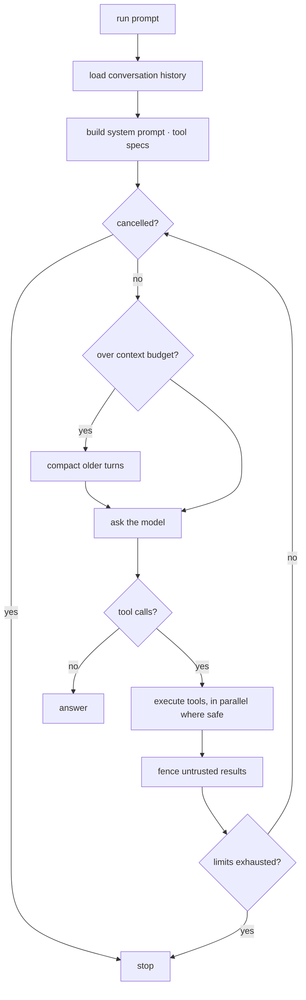

# Agent runtime

[`agent/runtime.py`](../src/tgagent/agent/runtime.py). Not `user → LLM →
response`: one run is a bounded, observable, cancellable sequence of steps, each
of which may call several tools.

## The loop



Each iteration: compact if needed → one model call → execute any tool calls →
feed results back. It ends when the model stops calling tools, or when a limit is
hit.

## Bounds

Everything that could run away is bounded, and everything that could surprise you
is observable.

| Limit | Default | Stops |
|---|---|---|
| `max_steps` | 25 | An endless plan/act loop |
| `max_tool_calls` | 100 | Tool thrashing |
| `max_consecutive_tool_errors` | 4 | Retrying a broken call forever |
| `step_timeout` | 300s | One wedged step |
| `run_timeout` | 1800s | The whole run |
| `tool_timeout` | 120s | One wedged tool |

A run that stops early sets `stopped_because` and still returns whatever it had.
A successful call **resets** the consecutive-error counter, so a transient
failure does not count against a genuinely progressing run.

## Failure handling

| Failure | Behaviour |
|---|---|
| Tool raises | Caught, returned to the model as an error result. The run continues. |
| Permission denied | Same — the model adapts and reports. Never a crash. |
| Tool times out | Reported as an error result; the run continues. |
| Unknown tool | Error result listing the available tools. |
| LLM transient error | Retried with backoff inside the provider adapter. |
| LLM hard failure | Run ends cleanly, with an answer that says so **and** notes nothing was changed on the account. |
| Event callback raises | Logged and ignored. A broken UI must not kill a run. |
| Cancellation | Checked between steps and before each tool. |

## Context management

[`agent/context.py`](../src/tgagent/agent/context.py). When the estimated history
crosses `compaction_threshold` (0.7) of the available budget, older turns are
replaced by a model-written summary and the most recent `compaction_keep_recent`
turns are kept verbatim.

Two details are load-bearing:

**Tool-call pairs are never split.** Every provider rejects a conversation
containing a `tool_call` with no matching `tool_result`, so the split point is
snapped backwards to a safe boundary rather than taken literally from the
"keep N" setting.

**Summarisation failure degrades rather than kills.** If the summary call itself
fails, a mechanical digest is produced — lossy, but it preserves what was asked
and which tools ran, so the run can still finish. Only if the recent turns
*alone* exceed the window does `ContextOverflowError` surface, with advice about
reducing page sizes.

Token counts are **estimates** (~3.5 chars/token, tuned to over-count slightly).
Exact counting means a network round trip per measurement, which is far too
expensive for a check that runs every step. Compacting slightly early is
harmless; compacting late overflows.

## Trust enforcement

The runtime is where the trust boundary is applied, not each tool:

- The **operator's prompt** enters unfenced as a `USER` turn.
- A tool result marked `TrustLevel.UNTRUSTED` is **fenced** by the runtime before
  it reaches the model, with any injection-scan annotation attached.
- Oversized results are truncated **head and tail** — the head carries structure,
  the tail carries the cursor needed to continue.

Because fencing happens centrally, a tool author cannot forget to do it. Marking
the result correctly is the only obligation.

## Persistence and replay

Turns are persisted as they happen, in the provider-neutral format, so a
conversation recorded against one provider replays against another.

Reloading handles the messy case: a run interrupted mid-step leaves an assistant
turn requesting tools whose results were never written. Replaying that is a hard
400, so `_drop_dangling_tool_calls` rewrites the orphan into plain text
(`[interrupted before these tools completed: …]`) and drops any result whose
request has just been rewritten away.

## Events

The runtime emits events; interfaces render them. The core imports nothing from
any interface — which is what keeps the CLI swappable.

| Event | Carries |
|---|---|
| `run_started` | run id, conversation id, tool count |
| `step_started` | step number |
| `text_delta` / `thinking_delta` | streamed chunks |
| `assistant_message` | a complete message |
| `tool_call_started` | tool name, arguments |
| `tool_call_finished` | ok, duration, metadata |
| `context_compacted` | before/after token estimates |
| `warning` / `error` | message |
| `run_finished` | the `RunResult` |

```python
def render(event):
    if event.kind is EventKind.TOOL_CALL_STARTED:
        print(f"→ {event.data['tool']}")

result = await runtime.run("…", on_event=render)
```

Callbacks may be sync or async; both are handled.

## Parallel tool calls

When a step requests several tools, they run concurrently up to
`max_parallel_tools` (4). Most multi-tool steps are independent reads, so this is
a real latency win. State-changing operations are serialised anyway by the
gateway's write throttle, so ordering hazards do not accumulate.

Set `parallel_tool_calls: false` to force sequential execution.

## Using it directly

```python
from tgagent.app import Application

app = Application(settings, confirmations=my_provider)
await app.start(connect_telegram=True)

runtime = app.build_runtime()
result = await runtime.run(
    "summarise January with @alex",
    conversation_id=None,
    interactive=True,
    on_event=render,
    cancel=cancel_event,
)

print(result.answer, result.summary_line())
await app.stop()
```

`Application` is the composition root: it constructs every dependency and owns
lifecycle, connecting in a deterministic order and tearing down in reverse.
