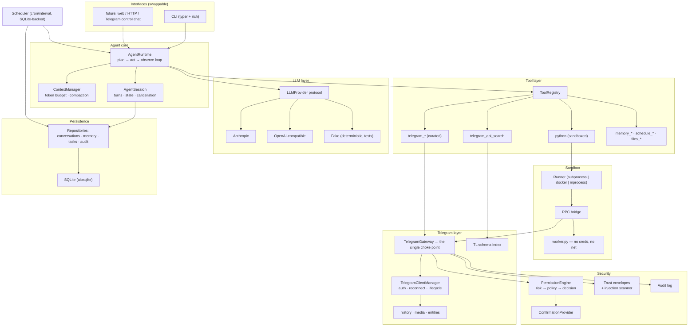
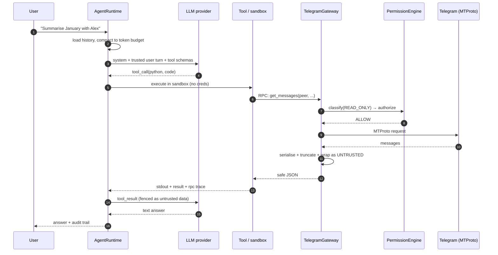

# Architecture

> This is the primary design document. Individual decisions with meaningful
> trade-offs are recorded as ADRs under [`docs/decisions/`](decisions/).

## 1. What this system is

`tgagent` is an agent runtime that drives a **real Telegram user account** through
MTProto. The user talks to it in natural language; it decomposes the request into
Telegram operations, executes them under a permission policy, and reports back.

It is deliberately **not** a Telegram bot. Bot API accounts cannot read a user's
dialog list, cannot search a user's full history, and cannot act as the user. The
whole point is to operate the account the user already has.

## 2. The central architectural question

The brief's hardest constraint:

> The Telegram API library must be treated as a programmable capability available
> to the agent. Do NOT manually create hundreds of individual LLM tools.

Telethon exposes **~1,400 generated TL request classes** plus ~500 friendly
methods. Three approaches were considered.

| Approach | Capability | Safety | Observability | Token cost | Verdict |
|---|---|---|---|---|---|
| **A.** One LLM tool per API method | Total | Good (per-tool policy) | Excellent | Catastrophic — schemas alone exceed any context window | Rejected by the brief, and correctly so |
| **B.** A single `invoke_raw(method, params)` tool | Total | Good | Excellent | Cheap | Good, but the model must issue one round trip per call; multi-step work (resolve → paginate → filter → download) costs dozens of turns |
| **C.** Sandboxed Python that drives the client | Total | **Hard** — arbitrary code next to a live session and secrets | Poor if naive | Cheap | Powerful but dangerous as usually implemented |

The design chosen is **C, restructured so that its danger is removed**, with B
retained inside it, and a small curated tool layer on top.

### 2.1 The key inversion: the sandbox holds no capability

The usual "let the model write code" design hands generated code a live client
object. That is indefensible here: the code shares a process with the session
file, the API hash, and the LLM key. One `open()` or `import socket` and the
account is gone.

Instead:

```
┌──────────────── host process (trusted) ─────────────────┐
│  Telethon client · session file · API keys · policy     │
│                                                          │
│      ┌─── TelegramGateway ───┐                           │
│      │ classify → authorize  │                           │
│      │ → confirm → execute   │                           │
│      │ → audit → serialize   │                           │
│      └───────────▲───────────┘                           │
│                  │ JSON-lines RPC over pipes             │
└──────────────────┼───────────────────────────────────────┘
                   │
┌──────────────────┴──── sandbox process (untrusted) ──────┐
│  model-generated Python                                   │
│  NO client · NO secrets · NO network · NO filesystem      │
│  only:  tg.<method>(...)  →  RPC  →  gateway              │
└───────────────────────────────────────────────────────────┘
```

The sandbox gets a **proxy object**, not a client. Every attribute access on
`tg` marshals a request over a pipe. The child process never holds a credential,
never opens a socket, and never sees a session file. Even a complete escape of
the Python-level restrictions yields a process whose only outbound channel is a
pipe to a policy enforcer.

That inversion is what makes "give the model a programming language" acceptable:

- **Every** Telegram operation — from generated code or from a tool — funnels
  through one `TelegramGateway.call()`. Permissions, rate limits, confirmation
  prompts, and the audit log are enforced in exactly one place.
- Generated code is fully observable: the RPC log *is* the trace.
- Multi-step work costs one LLM turn instead of twenty.

### 2.2 The three access tiers

The agent has three ways to reach Telegram, in increasing order of generality:

1. **Curated tools** (~20). Token-efficient, paginated, summarising wrappers for
   the operations that dominate real usage: list dialogs, resolve an entity,
   search, read history windows, send, download. These carry hand-written
   descriptions, tight JSON Schemas, and pre-shrunk output. Most tasks never
   go past this tier.
2. **`telegram_api_search`**. A local, offline, full-text index built by
   reflecting over the installed Telethon package at first use. The agent looks
   up any TL method or friendly method, its parameters and its types, without
   any of it sitting in the system prompt. This is how it discovers APIs it does
   not already know.
3. **`python` (sandboxed)**. Arbitrary composition. `tg.*` reaches every
   friendly method; `tg.invoke_raw()` reaches every one of the ~1,400 TL request
   classes. This is the escape hatch that makes the API surface genuinely
   unrestricted.

Tier 2 exists so tier 3 is usable: the agent can look up an obscure method's
signature and then call it, rather than guessing.

## 3. Component map



## 4. Data flow: one turn



## 5. Trust model

Four distinct trust levels, represented in code by `tgagent.security.trust.TrustLevel`
and enforced by how content enters the prompt.

| Level | Sources | Authority |
|---|---|---|
| `SYSTEM` | The system prompt, built from constants in `agent/prompts.py` | Full. Never derived from runtime data. |
| `USER` | What the operator typed at the CLI, or a scheduled task's stored prompt | Instructions. May request actions, subject to policy. |
| `AGENT` | The model's own plans, generated code, tool arguments | Proposals. Never authoritative; always re-checked by the permission engine. |
| `UNTRUSTED` | **Telegram message text, filenames, captions, chat titles, usernames, bios, tool stdout, any fetched web content** | Data only. Never instructions. |

Everything at `UNTRUSTED` is wrapped before it reaches the model:

```
<untrusted_data source="telegram:chat/-100123" id="a3f1">
… content, with any nested sentinel neutralised …
</untrusted_data>
```

The sentinel token embedded in the tag is random per process, so content cannot
forge a closing tag and "break out" into instruction context. The system prompt
states, as a standing rule, that nothing inside such a block is ever an
instruction. A heuristic scanner additionally flags likely injection attempts and
annotates the block, which both hardens the model's handling and gives the audit
log a signal.

This is defence in depth, not a proof. The authoritative control is the
permission engine: even a fully successful injection can only ask for an action,
and every externally-visible or destructive action is gated in code. See
[`docs/threat-model.md`](threat-model.md).

## 6. Permission model

Operations are classified into five risk tiers, and each tier maps to a policy
decision that is configurable per deployment:

| Tier | Examples | Default |
|---|---|---|
| `READ_ONLY` | `get_messages`, `get_dialogs`, `get_entity`, search | allow |
| `REVERSIBLE` | mark read, pin/unpin, react, download, draft | allow |
| `EXTERNALLY_VISIBLE` | **send**, edit, forward, join, leave, upload, typing | **confirm** |
| `DESTRUCTIVE` | delete messages, delete/leave-and-purge chats, kick, ban | **confirm** |
| `ACCOUNT_SECURITY` | password/2FA, sessions, privacy, account deletion, `auth.*` | **deny** |

Classification is driven by a rule table over method names (`telegram/../security/permissions.py`),
with an explicit **default-deny for unknown methods** at the `EXTERNALLY_VISIBLE`
tier or above — a new Telethon release cannot silently introduce an unclassified
destructive method that gets auto-allowed.

Policy is expressed in YAML and can override per tier and per method, plus
allow/deny lists over chats. Confirmation is delivered through a
`ConfirmationProvider` interface, so the CLI can prompt interactively while a
scheduled task uses a non-interactive provider that denies (or auto-approves a
narrow allowlist) without hanging.

## 7. Large histories

A Telegram account can hold millions of messages. The design assumes the history
never fits in context:

- All history access is **cursor-paginated** with hard page and total caps.
- The gateway **serialises TL objects into a compact, flattened dict** and
  truncates long text at a configured limit, so a single message costs tens of
  tokens rather than hundreds.
- Server-side filters (`search`, `filter=`, `offset_date`) are preferred over
  client-side scanning, and the curated tools expose them prominently.
- Bulk scanning happens **inside the sandbox**, where the agent can loop over
  thousands of messages and return only the handful that matter. This is the
  single biggest reason the code-execution tier exists: filtering 5,000 messages
  down to 12 costs one turn and ~600 output tokens instead of 50 turns.
- The runtime maintains a token budget and compacts older turns into a summary
  when the estimated context exceeds a configurable fraction of the window.

## 8. Storage

SQLite via `aiosqlite`, behind repository protocols. It is genuinely the right
tool: single-writer, embedded, transactional, zero operational cost, and the data
volume (conversations, task rows, memory facts, audit entries) is small. The
repository interfaces (`storage/base.py`) are narrow enough that a Postgres
implementation is a drop-in, and migrations are explicit, versioned SQL.

## 9. Scheduling

A purpose-built SQLite-backed scheduler rather than APScheduler. The reason is
persistence semantics: APScheduler's persistent job stores pickle callables,
which is both a security liability and a versioning hazard. Here a scheduled task
is *data* — an id, a cron or interval spec, a prompt string, a policy override,
timestamps — so it survives restarts, upgrades, and code changes cleanly, and can
be inspected and edited with `sqlite3`. `croniter` handles cron arithmetic.

Missed runs are handled explicitly (catch-up window, or skip to next), and the
scheduler is a normal asyncio task with graceful shutdown.

## 10. Extension points

| To add… | Implement | Register |
|---|---|---|
| An LLM provider | `LLMProvider` protocol | `llm/registry.py` |
| A tool | `Tool` protocol | `tools/registry.py` |
| An interface | Drive `AgentRuntime` | — (core has no interface imports) |
| A storage backend | `storage/base.py` protocols | `app.py` composition root |
| A sandbox strategy | `SandboxRunner` protocol | `sandbox/__init__.py` |
| A confirmation channel | `ConfirmationProvider` | `app.py` |

The composition root is `tgagent/app.py`; nothing else constructs its own
dependencies. That is what keeps the interface swappable and the tests
deterministic.
