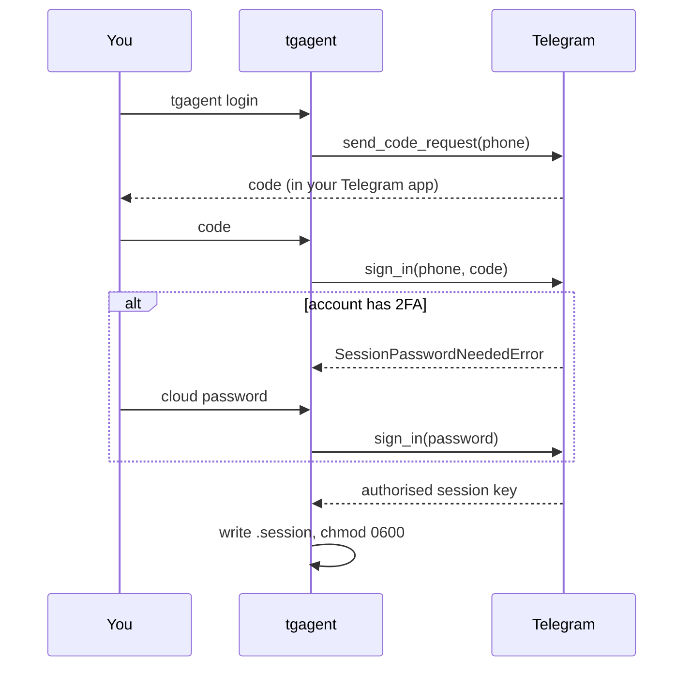

# Authentication

Signing in as a real Telegram user, and what the resulting session is.

## The flow

```console
$ tgagent login
Phone number (e.g. +15551234567): +15551234567
Login code from Telegram: 12345
Two-factor password: ********
Signed in successfully.
  Account : Alex (id 123456789)
  Username: @alex
  Session : /home/alex/.local/share/tgagent/sessions/tgagent.session
```

What happens:

1. **Connect** to Telegram with your `api_id`/`api_hash`.
2. **Request a code** — Telegram sends it to your *existing* Telegram apps (or
   by SMS if you have none signed in).
3. **Submit the code.**
4. **Submit the 2FA password** if the account has two-factor authentication. The
   prompt only appears when Telegram asks for it.
5. **The session is written** to disk, owner-only on POSIX.

If a valid session already exists, `login` says so and changes nothing.



## What the session file is

`<data_dir>/sessions/tgagent.session` is a SQLite database holding an
**authenticated session key**.

> Anyone with this file can read and send as your account. They do not need your
> phone, your password, or your 2FA. Treat it exactly like an SSH private key.

Protections in place:

- `.gitignore` excludes `*.session` and `sessions/` — plus CI fails the build if
  one is ever committed.
- The directory is created `0700` and the file `0600` on POSIX. Windows has no
  equivalent; see [limitations](limitations.md).
- The sandbox cannot reach it: the worker process runs with a scrubbed
  environment, an import allow-list that excludes `os` and `pathlib`, and no
  `open()`. See [sandboxing](sandboxing.md).
- It is never logged. The redaction layer strips session strings, hashes, and
  anything matching a credential shape from every log line.

## Two-factor authentication

If the account has a cloud password, tgagent prompts for it during login. It is
used once, for that sign-in, and never stored.

The agent **cannot change your 2FA settings**: everything in the
`account.*` and `auth.*` namespaces is classified `account_security`, which the
default policy **denies outright** — not "confirms", denies. There is no prompt
to click through by accident. See [permissions](permissions.md).

## Signing out

```console
$ tgagent logout
Signed out; the session was revoked on Telegram.
```

This revokes the session **server-side** first, then deletes the local files.
Order matters: deleting the file alone leaves an authorised session listed on
your account indefinitely.

You can also revoke from any Telegram client: **Settings → Devices → Terminate**.
tgagent handles that gracefully — the next call fails with an authorisation
error and tells you to sign in again.

## Non-interactive environments

Sign-in is deliberately interactive: it needs a code that only reaches your
phone. There is no headless login path, by design.

For a server, sign in **once** interactively, then move the session file:

```bash
# On your workstation
tgagent login
scp ~/.local/share/tgagent/sessions/tgagent.session server:/srv/tgagent/sessions/

# On the server
chmod 600 /srv/tgagent/sessions/tgagent.session
```

For Docker, sign in through an interactive run into the same volume the daemon
uses:

```bash
docker compose run --rm tgagent login
docker compose up -d
```

## Reconnection

Telethon reconnects automatically after transient drops. What it does not do is
tell the application when it has given up, so tgagent supervises the connection
itself: a watchdog waits on the disconnect signal and re-establishes with capped
exponential backoff (2s → 300s). A laptop closing its lid or a network changing
under a long-running scheduled task recovers on its own.

If the session has been revoked while disconnected, the watchdog notices and
stops rather than retrying forever.

## Programmatic use

Interfaces other than the CLI supply their own prompts:

```python
from tgagent.telegram.auth import LoginFlow
from tgagent.telegram.client import TelegramClientManager
from tgagent.config import load_settings

settings = load_settings()
manager = TelegramClientManager(settings.telegram, settings.session_path)

flow = LoginFlow(
    manager,
    phone=settings.telegram.phone,
    request_code=lambda: ask_the_user_somehow("Login code"),
    request_password=lambda: ask_the_user_somehow("2FA password"),
)
result = await flow.run()
```

Each prompt is an `async () -> str`. Nothing in `LoginFlow` reads stdin or
prints, which is what makes it reusable across a CLI, a web UI, or a test.

## Errors you might see

| Message | What it means |
|---|---|
| `That login code is incorrect.` | Typo, or the code was already used. |
| `That login code has expired.` | Codes are short-lived. Start again. |
| `That two-factor password is incorrect.` | Cloud password, not the login code. |
| `No Telegram account exists for that number.` | tgagent deliberately does not create accounts. Sign up in an official client first. |
| `Too many login attempts…` | A `FLOOD_WAIT`. Wait the stated time; retrying sooner extends it. |
| `That phone number is banned from Telegram.` | Contact Telegram support. |
| `Not signed in to Telegram. Run tgagent login first.` | No session, or it was revoked. |

More in [troubleshooting](troubleshooting.md).
