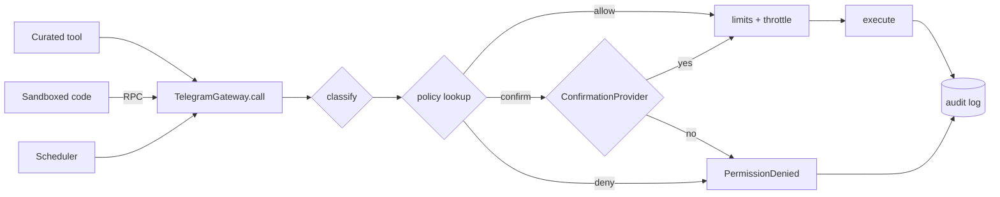

# Permission system

Implemented in [`security/permissions.py`](../src/tgagent/security/permissions.py)
and enforced in [`telegram/gateway.py`](../src/tgagent/telegram/gateway.py). It is
code, not documentation: nothing reaches Telegram without passing through it.

## Risk tiers

| Tier | Meaning | Examples |
|---|---|---|
| `read_only` | Reads state; nobody else can tell | `get_messages`, `messages.Search`, `get_dialogs`, `get_participants` |
| `reversible` | Trivially undoable, nobody is notified | `messages.ReadHistory`, `download_media`, `messages.SaveDraft` |
| `externally_visible` | **Other people see it** | `send_message`, `edit_message`, `forward_messages`, `channels.JoinChannel`, `messages.SendReaction`, uploads |
| `destructive` | Destroys data | `delete_messages`, `messages.DeleteHistory`, `channels.EditBanned`, `channels.LeaveChannel`, `contacts.Block` |
| `account_security` | The account's security posture | `account.UpdatePasswordSettings`, `auth.LogOut`, `account.ResetAuthorization`, `account.UpdatePrivacy` |

Tiers are ordered, so a policy can express "confirm anything at
`externally_visible` or above".

### Classification

Method names arrive in two shapes — raw TL (`messages.SendMessage`) and Telethon
friendly (`send_message`) — and both are normalised (lowercased, `Request` suffix
stripped) before matching explicit tables. A policy written either way governs
calls made either way; capitalisation cannot be used to dodge a rule.

**The fallback is the important part.** An unrecognised method that does not look
like a read is classified `destructive`:

```python
classify("messages.SomeBrandNewThing")  # → DESTRUCTIVE
classify("obliterate_everything")  # → DESTRUCTIVE
classify("messages.GetSomethingNew")  # → READ_ONLY  (read-shaped prefix)
```

A future Telethon release cannot introduce a method that silently executes.

Check any method:

```console
$ tgagent config policy messages.DeleteHistory
╭──────── Policy explanation ────────╮
│ Method   : messages.DeleteHistory  │
│ Risk tier: destructive             │
│ Decision : confirm                 │
│ Override : no                      │
╰────────────────────────────────────╯
```

## Decisions

`allow` · `confirm` · `deny`. Defaults:

```yaml
read_only: allow
reversible: allow
externally_visible: confirm
destructive: confirm
account_security: deny
```

A **denial is not a crash**. It is returned to the model as a tool result, so the
agent adapts and reports rather than the run dying. The system prompt explicitly
tells it not to route around a refusal by finding a different method that does
the same thing.

## The policy file

Copy [`policy.example.yaml`](../policy.example.yaml) and point at it:

```bash
export TGAGENT_PERMISSIONS__POLICY_FILE=./policy.yaml
```

```yaml
defaults:
  read_only: allow
  reversible: allow
  externally_visible: confirm
  destructive: confirm
  account_security: deny

method_overrides:
  messages.DeleteHistory: deny       # no case where an agent should purge history
  channels.LeaveChannel: deny        # loses access to the history
  messages.ReadHistory: allow

chat_allowlist: ["@my_notes_bot"]    # writes confined to these
chat_denylist:  ["@company_announcements"]

read_only_mode: false
non_interactive_decision: deny
confirmation_timeout: 300
max_outbound_per_run: 20
```

**Unknown keys are a hard error.** A typo in a security policy that silently does
nothing is exactly the failure worth preventing:

```
Unknown key(s) in policy ./policy.yaml: read_only_mod.
Valid keys: chat_allowlist, chat_denylist, confirmation_timeout, defaults, …
```

A partial `defaults` mapping is merged with the conservative baseline, so
tightening one tier cannot leave the others undefined.

## Beyond per-call decisions

Blast-radius limits, independent of whether any individual call was approved:

| Control | Default | Purpose |
|---|---|---|
| `max_outbound_per_run` | 20 | Even fully approved, one run cannot message a hundred people |
| `min_seconds_between_writes` | 1.0s | Spacing so a looping agent cannot trip Telegram's spam heuristics |
| `chat_allowlist` / `chat_denylist` | — | Writes confined to (or excluded from) named chats. Reads unaffected |
| `read_only_mode` | false | Global kill switch |

Chat lists normalise `@` and case, so `@Work`, `work`, and `@work` are one thing.
With an allow-list configured, a write with **no identifiable target** is denied
rather than assumed safe.

## Confirmation

When policy says confirm, a `ConfirmationProvider` asks. Which one depends on the
interface:

| Provider | Used by |
|---|---|
| `CallbackConfirmation` | CLI — prompts on the terminal, with a timeout |
| `AutoDenyConfirmation` | Default for unattended execution |
| `AutoApproveConfirmation` | Tests, and `--yes`. Logs loudly every time |

Every provider must honour a timeout; a prompt that hangs would wedge the loop,
so silence resolves to **declined**.

Approving a non-destructive operation offers "remember for this run", which
covers a task that legitimately sends several messages. Destructive operations
never offer it.

### Unattended runs

Scheduled tasks have nobody to ask, so `confirm` becomes
`non_interactive_decision` — **deny** by default. The system prompt tells the
agent it is unattended so it plans accordingly and reports what it could not do.

If a scheduled task genuinely needs to send, grant that explicitly and narrowly:

```yaml
method_overrides:
  messages.SendMessage: allow
chat_allowlist: ["@my_notes_bot"]
max_outbound_per_run: 3
```

That is a deliberate, reviewable decision — which is the point of it living in a
file rather than a flag.

## How it is wired



Note that all three entry points converge *before* classification. There is no
path that reaches `execute` without passing `policy lookup`.

## Testing

[`tests/test_permissions.py`](../tests/test_permissions.py) covers classification
of ~40 methods across all five tiers, the unknown-method fallback, case and
suffix insensitivity, every decision path, chat lists, outbound budgets, and
non-interactive fallback. [`tests/test_gateway.py`](../tests/test_gateway.py)
proves enforcement actually happens at the choke point, and
[`tests/test_integration.py`](../tests/test_integration.py) proves generated code
cannot route around it.
