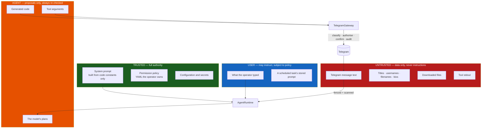

# Security model

This agent operates a real person's Telegram account. A failure here means
someone's private history read, messages sent in their name, or their data
destroyed. The security design is therefore the largest part of the project, not
a section of it.

Related: [threat model](threat-model.md) · [permissions](permissions.md) ·
[prompt injection](prompt-injection.md) · [sandboxing](sandboxing.md) ·
[privacy](privacy.md)

## The three properties everything rests on

### 1. There is exactly one path to Telegram

Every operation — from a curated tool, from model-generated code, from the
scheduler — goes through `TelegramGateway.call()`. Classification, authorisation,
confirmation, rate limiting, auditing, and output sanitisation happen there and
nowhere else.

This is what makes the policy real rather than advisory. There is no second route
that skips a check, because there is no second route.

### 2. The code sandbox holds no capability

The usual way to let a model write code is to hand generated code a live client.
That is indefensible when the process also holds the session file and the API
keys.

Instead the sandbox process gets a **proxy**: every attribute access marshals a
JSON request over a pipe to the host. The child has no client, no credentials, no
session, and no network. Its only channel out is the pipe — to the gateway, which
polices it identically to a tool call.

The design assumes the sandbox can be escaped and removes the prize.

### 3. Telegram content is data, never instructions

Message text, captions, filenames, chat titles, usernames, bios — everything an
attacker can write — is fenced before it reaches the model, and the permission
engine gates every consequential action regardless of what the model was
persuaded to believe.

## Trust boundaries



| Level | Sources | Authority |
|---|---|---|
| `SYSTEM` | System prompt, policy, configuration | Full. Never derived from runtime data. |
| `USER` | CLI input, stored task prompts | Instructions, subject to policy. |
| `AGENT` | Model plans, generated code, tool arguments | Proposals. Always re-checked. |
| `UNTRUSTED` | Telegram content, tool output, files, web pages | Data only. Never instructions. |

The critical asymmetry: **the model's own output is not trusted either**. It can
propose an action; it cannot authorise one.

## Permission model

Five risk tiers, each mapped to a configurable decision:

| Tier | Examples | Default |
|---|---|---|
| `read_only` | get_messages, search, get_dialogs | allow |
| `reversible` | mark read, download, save draft | allow |
| `externally_visible` | **send**, edit, forward, join, react | **confirm** |
| `destructive` | delete messages/history, kick, ban, leave | **confirm** |
| `account_security` | 2FA, sessions, privacy, log out | **deny** |

Two properties matter more than the table:

- **Unknown methods default to `destructive`** unless the name looks like a read.
  A future Telethon release cannot introduce something that silently executes.
- **Denial is not a crash.** The refusal is returned to the model as a tool
  result, so it adapts and reports rather than dying.

Beyond per-call decisions there are blast-radius limits: a per-run cap on
externally-visible operations, a minimum interval between writes, and optional
chat allow/deny lists. See [permissions](permissions.md).

## Secret handling

| Secret | Where it lives | Protection |
|---|---|---|
| `api_hash` | Config | `SecretStr`; registered with the log redactor; never in the sandbox environment |
| Session key | `<data_dir>/sessions/*.session` | `0600` file in a `0700` dir; git-ignored; CI fails if committed; unreachable from the sandbox |
| LLM key | Config or provider env var | `SecretStr`; redacted; stripped from the sandbox environment |
| 2FA password | Never stored | Used once during login, then discarded |

Redaction runs inside the structlog pipeline, so it covers every log line
including ones emitted by third-party libraries. Two mechanisms: exact-value
replacement for secrets the process was told about, and pattern matching for
credential *shapes* it was not (bot tokens, `sk-` keys, bearer headers, session
strings, 32-char hex). Numeric values are never key-redacted, so `input_tokens`
stays readable.

## Media handling

Downloaded files are hostile input:

- **Size is checked from metadata before the transfer starts**, not after a 2 GB
  file has landed.
- **MIME must be on an allow-list and the extension must not be on a blocklist.**
  Both, because either alone is trivially bypassed.
- **Filenames are sanitised, never trusted** — including the *fallback* name used
  when media carries none of its own, which is derived from the caller's peer
  reference and so is equally untrusted. `../../.ssh/authorized_keys` is reduced
  to a leaf name, and the resolved path is verified to still sit inside the
  download directory.
- **Media with no MIME type at all is refused** when an allow-list is configured,
  rather than treated as permitted. Photos, which legitimately carry none on the
  wire, are matched against the list as `image/jpeg`.
- **Per-run directories**, reaped on a retention schedule.
- **Nothing downloaded is executed, imported, or handed to the sandbox.** The
  sandbox learns a path and metadata, never contents.

## Auditing

Every gateway call is recorded: run id, method, risk tier, decision, target,
argument digest, success, duration, the injection scanner's score for whatever
came back, and origin (`tool` / `sandbox` / `scheduler`). Denials and failures are
recorded too — an audit log that only contains successes is not an audit log.

The score is its own column rather than a note on the failure reason, because a
call that read something manipulative may well have worked perfectly; conflating
the two makes every flagged read look like a broken call and loses the number as
data. `tgagent audit` shows it in the `Flag` column, blank when the content looked
clean.

Message text is **not** stored by default; only a hash of the arguments, which is
still enough to prove two calls were identical. Enable
`logging.log_call_arguments` if you need more, understanding that it puts user
data in the database.

```bash
tgagent audit -n 50
tgagent audit --run 8f3a1c2b
```

## Execution limits

A confused or manipulated agent is bounded in every dimension: steps, tool calls,
consecutive failures, per-step wall clock, per-run wall clock, per-tool timeout,
Telegram calls per sandbox execution, sandbox CPU and memory, output size, and
outbound operations per run.

## Reporting a vulnerability

See [`.github/SECURITY.md`](../.github/SECURITY.md). Use private disclosure —
never a public issue.
